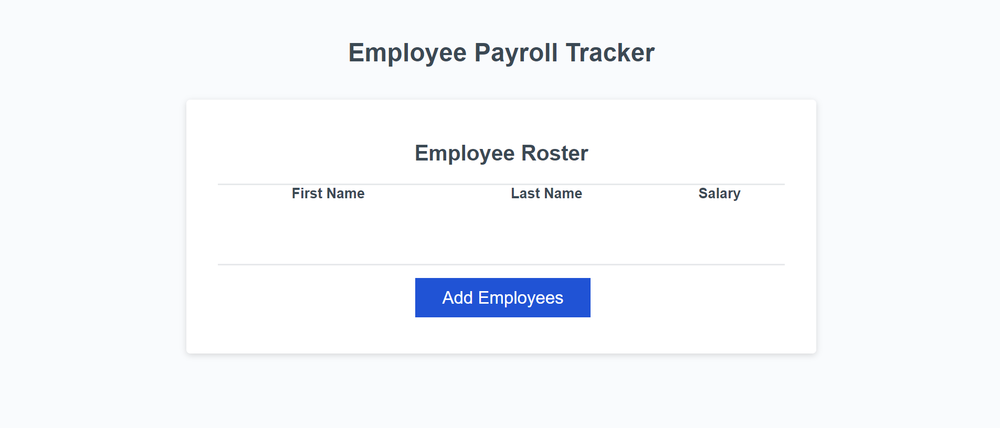

# PayrollTracker

## Description

An application that will input a list of employees and with their first name, last name, and salary. Enter as many employees as you want, the input process will repeat unitl the user confirms to the application that they are done. The appliction will display all employees in a table format. Within the console, the application will calacualte the average salary of all the employees and will pick one at random for any desired purpose. Builidng this app gave me my first taste of using JavaScipt in a real world application and taught me a lot about JS behavior and functionality.

## Usage
Click add employee and follow the prompts that will ask for the employee's information. The 4th prompt will ask if you'd like to add another employee, click yes to return to the beginning of the propmts to enter another employee or click no to finalize your entries.

https://muscarellaanthony.github.io/PayrollTracker/

## License

MIT License

Copyright (c) 2024 muscarellaanthony

Permission is hereby granted, free of charge, to any person obtaining a copy
of this software and associated documentation files (the "Software"), to deal
in the Software without restriction, including without limitation the rights
to use, copy, modify, merge, publish, distribute, sublicense, and/or sell
copies of the Software, and to permit persons to whom the Software is
furnished to do so, subject to the following conditions:

The above copyright notice and this permission notice shall be included in all
copies or substantial portions of the Software.

THE SOFTWARE IS PROVIDED "AS IS", WITHOUT WARRANTY OF ANY KIND, EXPRESS OR
IMPLIED, INCLUDING BUT NOT LIMITED TO THE WARRANTIES OF MERCHANTABILITY,
FITNESS FOR A PARTICULAR PURPOSE AND NONINFRINGEMENT. IN NO EVENT SHALL THE
AUTHORS OR COPYRIGHT HOLDERS BE LIABLE FOR ANY CLAIM, DAMAGES OR OTHER
LIABILITY, WHETHER IN AN ACTION OF CONTRACT, TORT OR OTHERWISE, ARISING FROM,
OUT OF OR IN CONNECTION WITH THE SOFTWARE OR THE USE OR OTHER DEALINGS IN THE
SOFTWARE.
